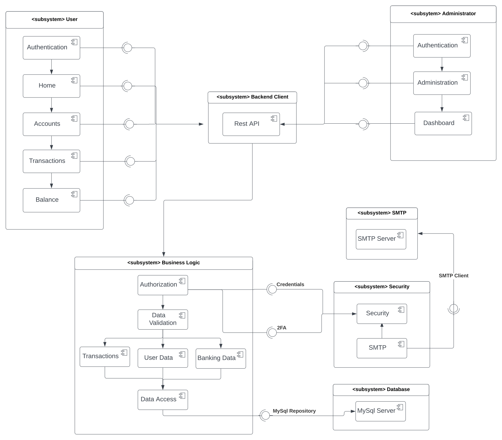
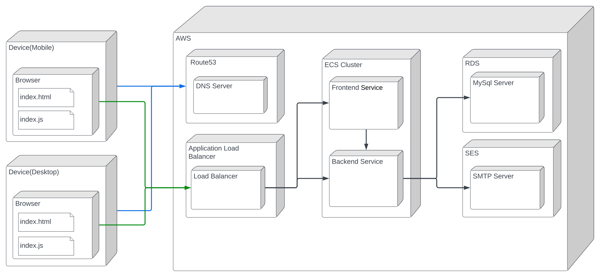
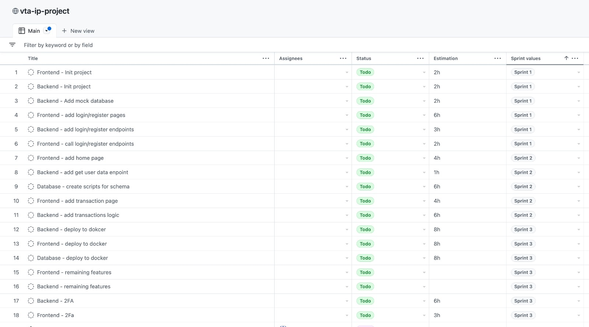

# Arhitectural Design Document

## Table of Contents

- [Arhitectural Design Document](#arhitectural-design-document)
  - [Table of Contents](#table-of-contents)
- [The Architectural Design Document](#the-architectural-design-document)
  - [Table of Contents](#table-of-contents-1)
  - [1. Introduction](#1-introduction)
    - [1.1 System Purpose](#11-system-purpose)
    - [1.3 Definitions, Acronyms](#13-definitions-acronyms)
    - [1.4 Reference Documents](#14-reference-documents)
  - [2. Design Objectives](#2-design-objectives)
  - [3. Proposed Architecture](#3-proposed-architecture)
    - [3.1 General Overview of the System Architecture](#31-general-overview-of-the-system-architecture)
    - [3.2 Subsystem Decomposition and Responsibilities](#32-subsystem-decomposition-and-responsibilities)
    - [3.3 Subsystem Distribution on Hardware/Software Platforms (distribution diagram)](#33-subsystem-distribution-on-hardwaresoftware-platforms-distribution-diagram)
    - [3.4 Persistent Data Management](#34-persistent-data-management)
    - [3.5 User Access Control to the System](#35-user-access-control-to-the-system)
    - [3.6 Global Control Flow](#36-global-control-flow)
    - [3.7 Boundary Conditions](#37-boundary-conditions)
  - [4. Planification](#4-planification)

# The Architectural Design Document

## Table of Contents

## 1. Introduction

An online banking platform is a digital service provided by a financial institution that allows its customers to perform various banking transactions and activities through the internet. The primary purpose of an online banking platform is to provide convenience and accessibility to customers, allowing them to access their account information, make payments, transfer funds, and manage their finances from anywhere with an internet connection

### 1.1 System Purpose

The system purpose is to provide customers with convenient and secure access to their banking accounts and services via the internet. It enables customers to perform various banking transactions and activities from their own devices, such as smartphones, tablets, or computers, without having to physically visit a bank branch.

### 1.3 Definitions, Acronyms

TODO

### 1.4 Reference Documents

- [Requirements Specification Document](Requirements%20Specification%20Document.md)

## 2. Design Objectives

1. Availability
   - The system will be available 24/7, 365 days a year.
   - The system will be hosted on AWS
   - The database will be hosted on an RDS instance.
   - The system will be deployed on multiple availability zones, and will be load balanced.
   - The system will be monitored using CloudWatch, and will be automatically scaled based on the load.

2. Security
   - The system will be secured using HTTPS.
   - The system will be secured using JWT tokens.
   - The system will be secured using 2FA.
   - The system will be secured using role based access control.
   - The system will be secured using password hashing.

3. Usability
   - The system will be easy to use.
   - The system will be responsive.
   - The system will be accessible from any device.

4. Maintainability
   - The system will be easy to maintain.
   - The system will be easy to extend.
   - The system will be easy to deploy.

## 3. Proposed Architecture

### 3.1 General Overview of the System Architecture

1. User subsystem
2. Administrator subsystem: As a privileged user, the administrator should ensure that the platform functions smoothly and securely, being able to operate in the following components: Authentication, Administration and Dashboard. 

Authentication:
-the adminsitrator should authenticate using its credentials.
-after a successful login, the administrator can view its account.

Administration:
-The administrator should review and administer user requests , such as password reset requests, account activation requests, or any other requests that require administrative approval.
-It has the right to change, modify or delete information from the system.

Dashboard:
-The administrator should be able to view its accont info.

3. Backend Client
4. Bussiness Logic
5. SMTP
6. Security 
7. Database

### 3.2 Subsystem Decomposition and Responsibilities

### 3.3 Subsystem Distribution on Hardware/Software Platforms (distribution diagram)

### 3.4 Persistent Data Management

For persistent data management, we will use a relational database, MySQL.
It will be running on an EC2 instance, and will be accessed by the application through a JDBC driver.
The backend application will access the database through the Hibernate ORM framework.

The database schema is defined in the following diagram:

### 3.5 User Access Control to the System

1. Authentication

   - authentication is performed in 2 steps (login and 2FA)
   - communication between the frontend and the backend is done through REST API
   - traffic is encrypted using HTTPS

2. Authorization

   - after the user is authenticated, the backend will generate a JWT token
   - JWT will be stored in the browser's local storage and send with every request
   - for an request to be authorized, the JWT token must be valid (not expired) and the user must have the required role
   - roles are stored in the database, and are assigned to users
   - JWT token expires after 72 hours (3 days)

3. User data management

   - user can only access their own data
   - only admins can access other user's data
   - admins can create, update and delete users
   - users can only update their own data
   - any other user specific data (transactions, savings accounts, etc.) follows the same rules as above

4. Security

   - passwords are hashed using BCrypt
   - communication between the frontend and the backend is done through HTTPS
   - JWT token has a limited lifetime
   - JWT token stores data about the device and cannot be used on another device

### 3.6 Global Control Flow

### 3.7 Boundary Conditions

Global:

1. No internet connection

- The application will not be able to access the database, and will not be able to perform any operations with the server.
- React will display an error message, but will allow the user to continue using the application with the data that is already loaded.

2. User is not logged in:

- The user will be redirected to the login page.

3. User is not allowed to perform an action:

- The user will be redirected to the home page.

Create a new user:

1. The user already exists:

   - No new user will be created, and the user will be notified that the username is already taken.

2. Password is not strong enough:

   - Frontend won't allow the user to submit the form, and will display a message with the requirements for the password.

3. Passwords don't match:

   - Frontend won't allow the user to submit the form, and will display a message that the passwords don't match.

4. Email is not valid:
   - Frontend won't allow the user to submit the form, and will display a message that the email is not valid.

Authenticate a user:

1. User doesn't exist:

   - The user will be notified that the username or password is incorrect. (The user will not be notified that the username doesn't exist, to prevent brute force attacks.)

2. Password is incorrect:

   - The user will be notified that the username or password is incorrect.

3. User is not verified:
   - The user will be notified that the account is not verified, and will be redirected to the verification page.

Perform a transaction:

1. The user doesn't have enough money:

   - The transaction will not be performed, and the user will be notified that they don't have enough money.

2. The destination account doesn't exist (same if the user is not verified):

   - The transaction will not be performed, and the user will be notified that the destination account doesn't exist.

Create a savings account:

1. The user already has a savings account:

   - The savings account will not be created, and the user will be notified that they already have a savings account.

## 4. Planification

Dashboard: https://github.com/users/vladtf/projects/1/views/1?sortedBy%5Bdirection%5D=asc&sortedBy%5BcolumnId%5D=38728626

Table:
