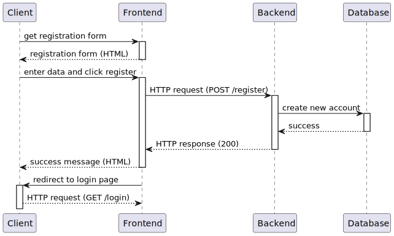
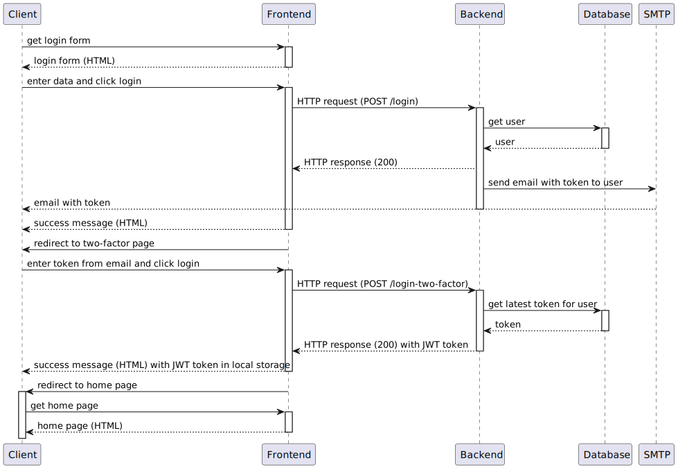
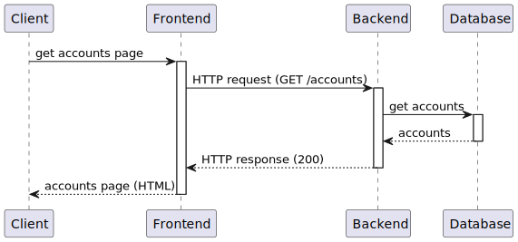
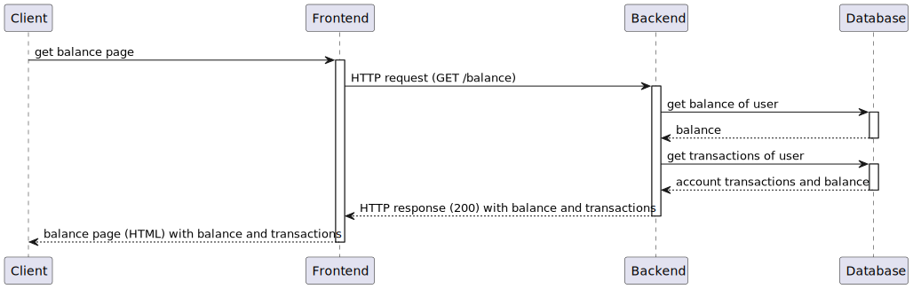
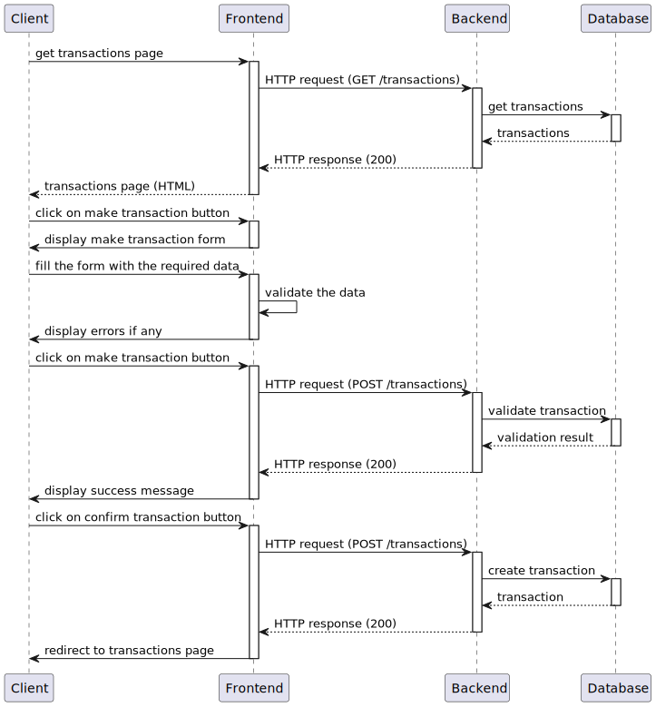
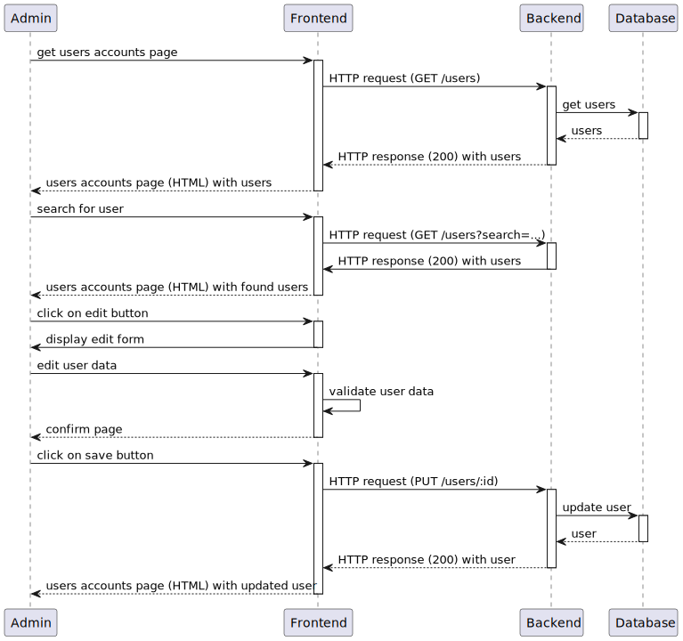
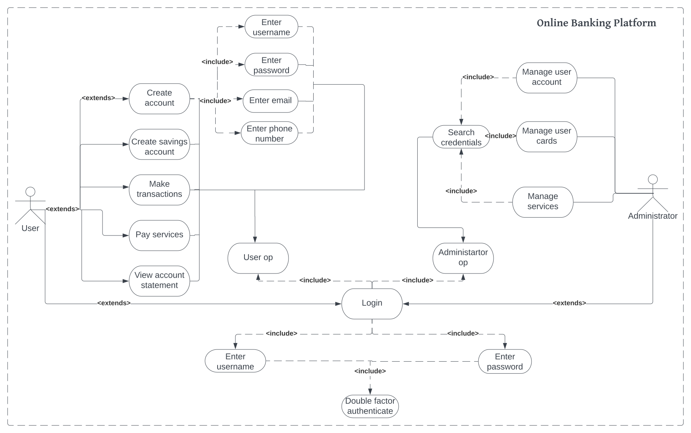

# ONLINE BANKING PLATFORM

# Requirements Specification Document

## Table of Contents

- [ONLINE BANKING PLATFORM](#online-banking-platform)
- [Requirements Specification Document](#requirements-specification-document)
  - [Table of Contents](#table-of-contents)
  - [Introduction](#introduction)
    - [Purpose of the document](#purpose-of-the-document)
    - [The context of system usage](#the-context-of-system-usage)
    - [List of definitions and abbreviations](#list-of-definitions-and-abbreviations)
  - [General Description](#general-description)
    - [Short description of the application](#short-description-of-the-application)
    - [Motivation](#motivation)
    - [Similar products](#similar-products)
    - [Risks](#risks)
  - [System solution](#system-solution)
    - [Descrierea categoriilor de utilizatori direcți/indirecți ai sistemului](#descrierea-categoriilor-de-utilizatori-direcțiindirecți-ai-sistemului)
    - [System requirements](#system-requirements)
    - [Functional requirements](#functional-requirements)
    - [Non-functional requirements](#non-functional-requirements)
    - [System models](#system-models)
      - [Actors and use cases through which they interact](#actors-and-use-cases-through-which-they-interact)
      - [Describe of use cases](#describe-of-use-cases)
      - [Context diagram](#context-diagram)

## Introduction

### Purpose of the document

The purpose of this document is to describe the requirements of an online banking management system. The system will be a web application that includes: user authentification, online account and credit cards management, transaction management, balance management, account statement, savings account and payment to an imaginary trader.

### The context of system usage

The context of system usage of an online banking management system would include the various situations and environments in which the system is used by customers to manage their banking activities online. This may include scenarios such as logging in to check account balances, transferring funds between accounts, paying bills, or setting up automatic payments.

### List of definitions and abbreviations

- **Administrator** - a person who manages the system
- **Client** - a person who uses the system
- **Account** - a bank account
- **Card** - a bank card
- **Transaction** - a bank transaction
- **Balance** - a bank balance

- **Docker** - a set of platform as a service products that use OS-level virtualization to deliver software in packages called containers
- **React** - a JavaScript library for building user interfaces
- **Spring Boot** - a framework to ease the bootstrapping and development of new Spring Applications

- **AWS** - Amazon Web Services
- **ECR** - Elastic Container Registry
- **ECS** - Elastic Container Service

## General Description

### Short description of the application

Web application developed using Java language, Spring framework,Node Js for javascripting and mySql database.

### Motivation

There are several motivations for implementing an online banking management system, including:

- Convenience: Online banking allows customers to access their accounts and manage their finances from anywhere, at any time, without the need to visit a physical branch.
- Improved customer service: Online banking can provide customers with a more personalized and efficient service experience, with features such as real-time account information, automated payments, and alerts for account activity.
- Increased security: Online banking systems can incorporate advanced security measures to protect customer data, including multi-factor authentication, encryption, and fraud detection.
- Competitive advantage: Offering an online banking management system can be a key differentiator for banks competing in a crowded marketplace, and can attract new customers who value the convenience and flexibility of digital banking.

### Similar products

- Revolut - Revolut is a digital banking and financial services company that provides a range of financial products and services to its customers through its mobile application. The company was founded in 2015 and is headquartered in London, UK.
- George BCR - digital banking platform provided by Banca Comerciala Romana (BCR), one of the largest banks in Romania. It was launched in 2016 and is available to BCR customers in Romania.

### Risks

While online banking management systems offer many benefits, there are also several risks associated with their use. Some of the common risks include:
Cybersecurity threats: Online banking systems are vulnerable to cyber attacks such as phishing, malware, and hacking, which can compromise customer data and lead to financial losses.
Fraudulent transactions: Criminals can use stolen credentials or other methods to initiate fraudulent transactions through online banking systems, leading to financial losses for both customers and banks.
System failures: Online banking systems can experience technical problems or outages that can prevent customers from accessing their accounts or completing transactions.
Human errors: Mistakes made by bank employees or customers, such as entering incorrect account information, can result in incorrect or unauthorized transactions.

## System solution

### Descrierea categoriilor de utilizatori direcți/indirecți ai sistemului

The platform includes two types of accounts: client and administrator.
Client:

- can view account information such as balances and transaction history including deposits, withdrawals, and transfers.
- can transfer funds between accounts, either within the same bank or to other banks.
- can create savings account.

Administrator:

- can troubleshoot and offer technical support, ensuring that any issues are resolved promptly and effectively.
- can create and manage user accounts for bank employees ensuring that each user has the appropriate level of access and permissions required to perform their job duties.

### System requirements

Desktop:

- operational system Windows, Linux or Mac OS
- browser (Chrome, Firefox, Opera, Safari, Edge) that supports HTML5, CSS3, JavaScript
- internet access with at least 1 Mbps speed

Mobile:

- operational system Android or iOS
- browser (Chrome, Firefox, Opera, Safari, Edge) that supports HTML5, CSS3, JavaScript
- internet access with at least 1 Mbps speed

### Functional requirements

Client is allowed to:

- login to the system using a username and password and a 2FA code
- to create a new bank account
- can create savings account
- to view the balance of the account (balances, transactions, etc.)
- to make transactions between accounts
- to pay services
- to view the account statement

Administrator can:

- manage user accounts (create, delete, update)
- manage user cards
- manage user transactions
- to solve issues raised by users

### Non-functional requirements

1. Hardware/software constrains:

- backend application will be developed in Java, using Spring Boot framework
- frontend application will be developed in JavaScript, using React framework
- both applications will be developed using a versioning system Git
- the result of development will be two Docker images containing the respective binaries
- Docker images will be uploaded to an AWS ECR repository
- images will be deployed on an AWS ECS server cluster
- applications will run continuously

2. Security requirements:

- the backend application should not expose sensitive data (password, card number, etc.) to the users without required permissions (not even through the frontend)
- users must be authenticated before performing any action in the application
- user role must be verified before performing any action in the application
- rights of each account must be well defined and separated between privileged and unprivileged
- simple users should not be able to perform operations that require administrator rights
- for operations that require administrator rights, simple users must enter an administrator password
- any data transfer between frontend and backend must be encrypted
- backend must accept only requests from the frontend specified in the requirements (not from other frontends)
- any attempt to access unauthorized resources must be reported to the administrator

### System models

#### Actors and use cases through which they interact

Client:

1. Create a new account

- the user enters the website and a registration form is displayed
- the user enters the required data (username, password, email, etc.)
- the user clicks on the register button
- an HTTP request is sent to the backend
- the backend verifies the data and creates a new bank account in the database
- the frontend displays a success message and redirects the user to the login page

2. Login

- the user enters the website and a login form is displayed
- enter the username and password and click on the login button
- an HTTP request is sent to the backend
- the backend verifies the data and returns a JWT token wich contains the user role and the user id (if the data is correct)
- frontend stores the token in the browser's local storage
- user is home page of the application where he can see his accounts

3. Create savings account

- the users navigates to accounts page
- click on the create savings account button
- fill the form with the required data (type of account, amount, etc.)
- click on the create button
- the frontend sends an HTTP request to the backend which creates a new savings account in the database and returns the new account to the frontend
- the user is redirected to the accounts page where he can see the new account

Prerequisites: the user must be logged in

4. View account balance

- the user navigates to balance page
- an request is sent to the backend which returns the balance of the account and the transactions
- frontend displays the balance and the transactions

Prerequisites: the user must be logged in

5. Make transactions between accounts

- the user navigates to transactions page
- click on the make transaction button
- fill the form with the required data (type of transaction, amount, destination account, etc.)
- click on the make transaction button
- backend verifies whether the user has enough money in the account and if the destination account exists and returns the result to the frontend
- the frontend displays a success message or an error message depending on the result of the operation
- if the validation is successful, an button is displayed to confirm the transaction and the user clicks on it to confirm the transaction
- backend creates a new transaction in the database and returns the new transaction to the frontend
- user is redirected to the transactions page where he can see the new transaction

Prerequisites: the user must be logged in

6. Pay services

- the user navigates to services page
- an list of services is displayed (electricity, water, gas, etc.)
- user selects the service he wants to pay and clicks on the pay button
- the backend returns the service details and the user is redirected to the payment page
- user clicks on the pay button and an request is sent to the backend which verifies whether the user has enough money in the account and returns the result to the frontend
- if everything is ok, then user can confirm the payment and the backend creates a new transaction in the database and returns the new transaction to the frontend
- user is redirected to the transactions page where he can see the new transaction

Prerequisites: the user must be logged in

7. View account statement

- the user navigates to balance page
- press the print button and an request is sent to the backend which returns details about the account and the transactions
- an pdf file is generated and downloaded to the user's computer

Prerequisites: the user must be logged in

Administrator:

1. Manage user accounts

- the admin navigates to the users accounts page
- search for a user by username or email
- click on the edit button to edit the user's data
- an form is displayed with the user's data and the admin can edit the data and click on the save button to save the changes (also he can click on the delete button to delete the user's account)
- an confirmation message is displayed before any action is performed

Preconditions: the user must be logged in and must have administrator rights

2. Manage user cards

- the admin navigates to the users cards page
- the admin can search for a user by username or email or by card number
- click on the edit button to edit the card's data
- an form is displayed with the card's data and the admin can edit the data and click on the save button to save the changes (also he can click on the delete button to delete the card)
- an confirmation message is displayed before any action is performed

Preconditions: the user must be logged in and must have administrator rights

3. Manage user transactions

- the admin navigates to the users transactions page
- the admin can search for a user by username or email or by transaction id
- click on the edit button to edit the transaction's data
- an form is displayed with the transaction's data and the admin can edit the data and click on the save button to save the changes
- an confirmation message is displayed before any action is performed

Preconditions: the user must be logged in and must have administrator rights

4. Manage services

- the admin navigates to the services page
- he can search for a service by name or by id or by provider
- select the service he wants to edit and click on the edit button (also he can click on the delete button to delete the service or on the add button to add a new service)
- an form is displayed with the service's data where the admin can edit the service and to link the service to clients
- an confirmation message is displayed before any action is performed

Preconditions: the user must be logged in and must have administrator rights

#### Describe of use cases

Clients use cases:

- create new account:

  - the user will fill personal data in the registration form(username, password, email etc)

- login:

  - the user can authenticate in its personal account using their credentials. Authentification proccess is a double factor one.

- create a savings account:
  - the user can create a separated account, within a main one, for savings
- view account balance:

  - the user can see the account details

- make transactions between accounts:

  - the user can transfer money in between different accounts

- pay services:

  - the user can view and pay different services(water, electrivity etc) within the account

- view account state:
  - the user can print account statement

Administrators use cases:

- manage user accounts:
  - the administrator can edit users information
- manage user cards:
  - the administrator can edit users cards information
- manage user transactions:
  - the administrator can edit transactions information
- manage services:
  - the administrator can edit services information

#### Context diagram

