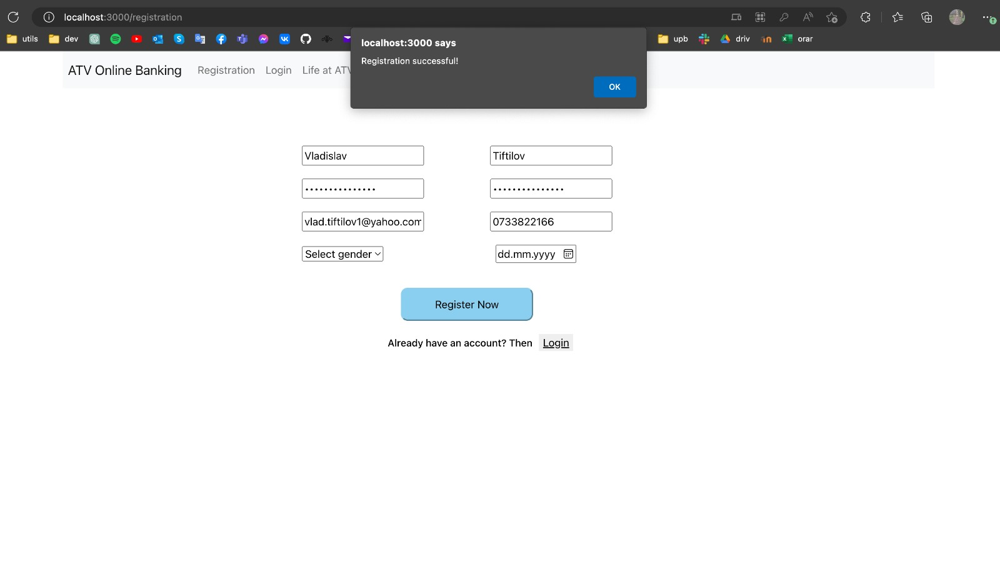
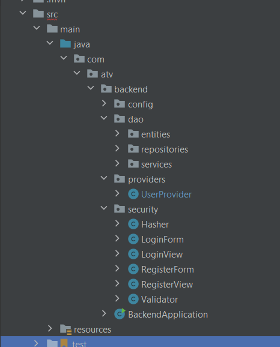
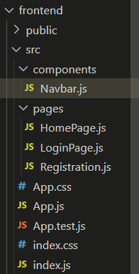
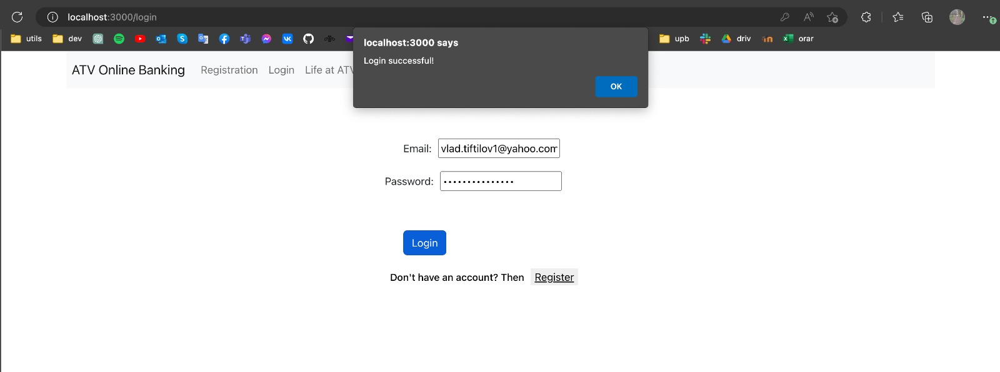
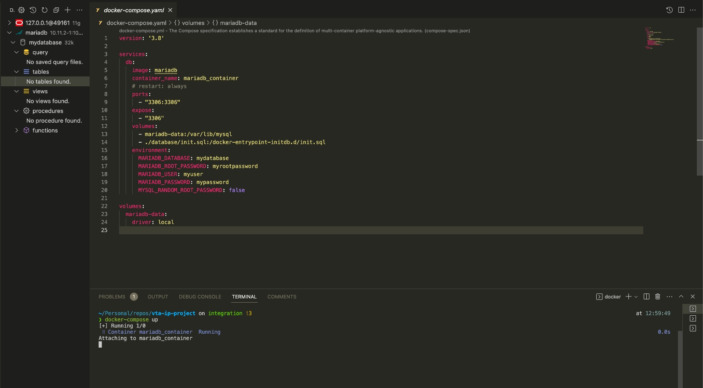

# Sprint 1 - Review

## Table of Contents

- [Sprint 1 - Review](#sprint-1---review)
  - [Table of Contents](#table-of-contents)
  - [Sprint 1 - Review](#sprint-1---review-1)
  - [Sprint 1 -Screenshots](#sprint-1--screenshots)
  - [Sprint 2 - Planification](#sprint-2---planification)

## Sprint 1 - Review

| Task                                     | Status      | Notes                                       | Assignee |
| ---------------------------------------- | ----------- | ------------------------------------------- | -------- |
| Frontend - Init project                  | Done        |                                             | Cosmin   |
| Backend - Init project                   | Done        |                                             | Laura    |
| Backend - Add mock database              | Done        |                                             | Laura    |
| Frontend - add login/register pages      | Done        | Works to do on styling the ui               | Cosmin   |
| Backend - add login/register endpoints   | Done        | Works to do on validation                   | Laura    |
| Frontend - call login/register endpoints | Done        | Should be done after the endpoints are done | All      |
| Database - create scripts for schema     | Done        | Created only required tables                | Vlad     |
| Database - deploy to docker              | Done        |                                             | Vlad     |

## Sprint 1 -Screenshots
- Ui View:

- Backend Hierarchy:
  

- Frontend Hierarchy:
  

- Login:
 

- Database:

## Sprint 2 - Planification

| Tasks                               | Estimation |
| ----------------------------------- | ---------- |
| Frontend - add home page            | 2h         |
| Backend - add get user data enpoint | 1h         |
| Frontend - add transaction page     | 2h         |
| Backend - add transactions logic    | 3h         |
| Backend - deploy to docker          | 1h         |
| Terraform - deploy to aws           | 4h         |
| Backend - add sending email logic   | 2h         |
| Frontend - add 2fa page             | 2h         |
| Backend - add 2fa logic             | 2h         |
