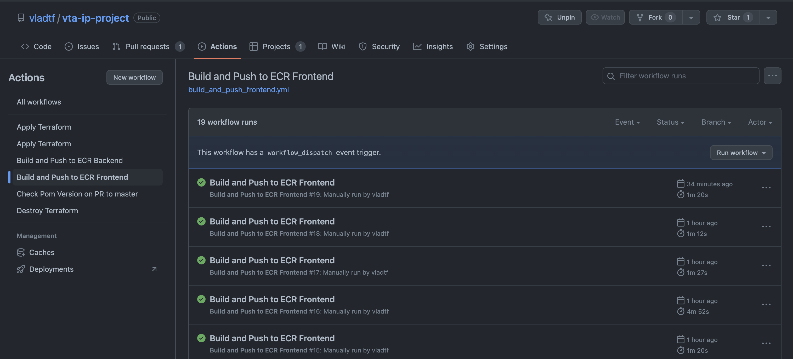
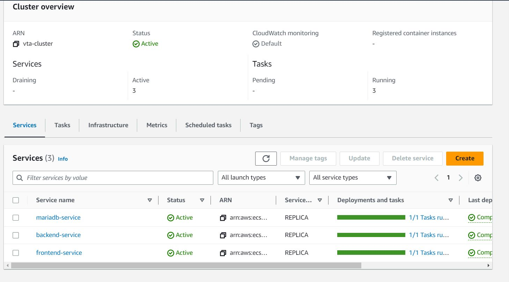
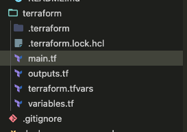
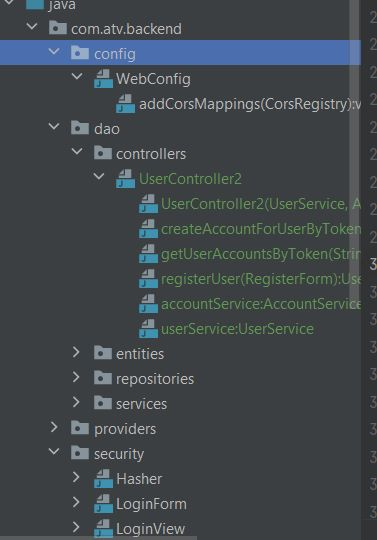

# Sprint 2 - Review

## Table of Contents

- [Sprint 2 - Review](#sprint-2---review)
  - [Table of Contents](#table-of-contents)
  - [Sprint 2 - Review](#sprint-2---review-1)
  - [Sprint 2 - Screenshots](#sprint-2---screenshots)
  - [Sprint 3 - Planification](#sprint-3---planification)

## Sprint 2 - Review

| Task                                  | Status | Notes                                       |
| ------------------------------------- | ------ | ------------------------------------------- |
| Frontend - add home page              | Done   |                                             |
| Backend - add get user data enpoint   | Done   |                                             |
| Frontend - add transaction page       | Done   |                                             |
| Backend - add transactions logic      | TODO   |                                             |
| Backend - deploy to docker            | Done   |                                             |
| Frontend - deploy to docker           | Done   |                                             |
| Frontend - add confirmation page      | Done   |                                             |
| Terraform - deploy to aws             | Left   | Bad design leading to implement workarounds |
| Backend - add sending email logic     | TODO   |                                             |
| Frontend - add 2fa page               | TODO   |                                             |
| Backend - add 2fa logic               | TODO   |                                             |
| Github - Add jobs to build apps       | Done   |                                             |
| Github - Add job to deploy terrafrom  | Done   |                                             |
| Github - Add job to destroy terraform | Done   |                                             |
| Github - Add a check from pom version | Done   |                                             |

## Sprint 2 - Screenshots

Github Jobs:

Aws Service:

Terraform:

Home Page:

Transaction Page:

Confirmation Page:

Rest Controllers:

## Sprint 3 - Planification

| Task                                             | Estimation |
| ------------------------------------------------ | ---------- |
| Backend - 2fa                                    | 2 h        |
| Frontend - 2fa                                   | 2 h        |
| Terraform - fix communication between components | 2 h        |
| Terraform - improve security                     | 2 h        |
| Backend - implement hashing                      | 2 h        |
| Frontend - integration with backend              | 2 h        |
| Frontend - improve error handling                | 2 h        |
