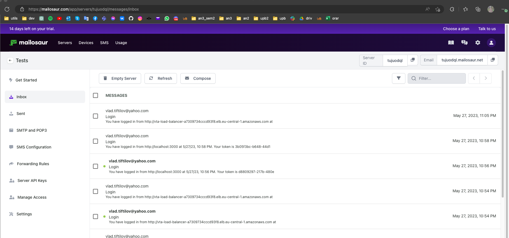
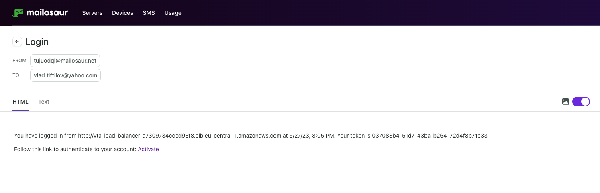
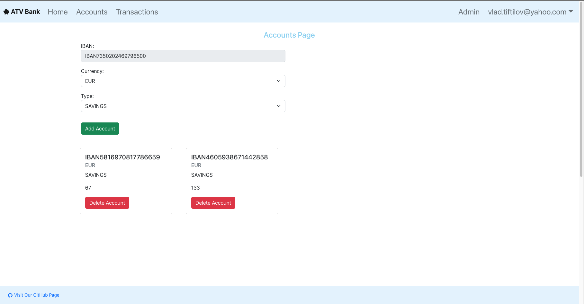
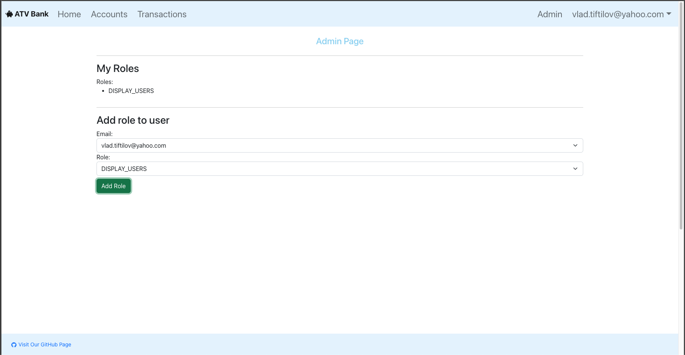
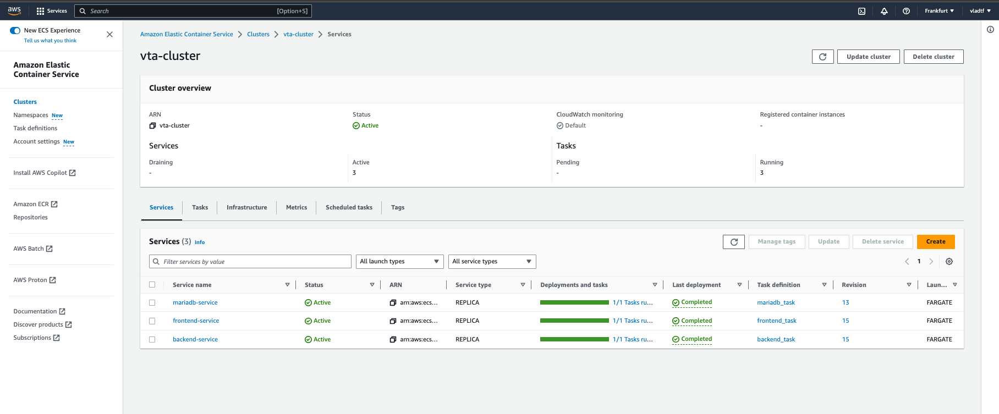
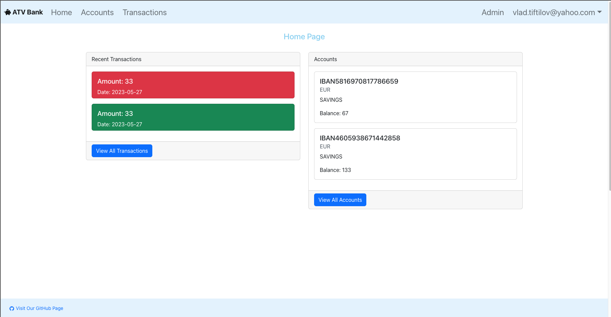
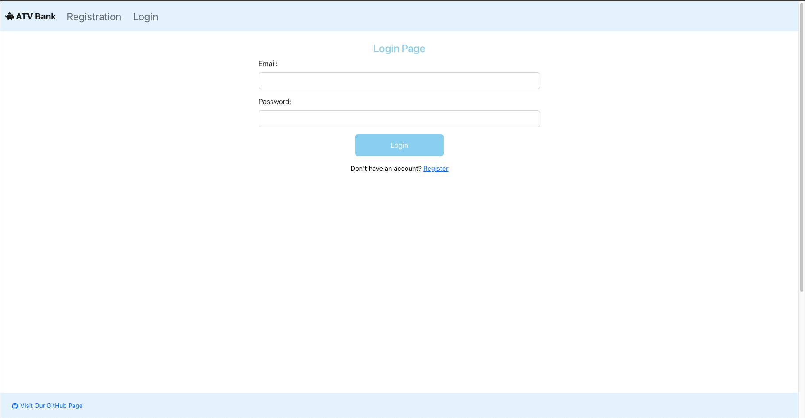
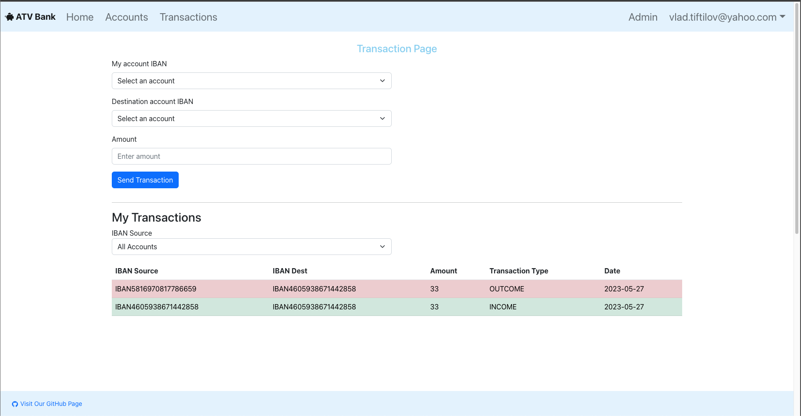

# Sprint 3 - Review

## Table of Contents

- [Sprint 3 - Review](#sprint-3---review)
  - [Table of Contents](#table-of-contents)
  - [Sprint 3 - Review](#sprint-3---review-1)
  - [Sprint 3 - Screenshots](#sprint-3---screenshots)

## Sprint 3 - Review

| Task                                             | Status | Notes |
| ------------------------------------------------ | ------ | ----- |
| Backend - add 2fa logic                          | Done   |       |
| Frontend - add 2fa page                          | Done   |       |
| Backend - add sending email logic                | Done   |       |
| Frontend - improve error handling                | Done   |       |
| Backend - deploy to docker                       | Done   |       |
| Frontend - deploy to docker                      | Done   |       |
| Terraform - deploy to aws                        | Done   |       |
| Terraform - fix communication between components | Done   |       |
| Terraform - improve security                     | TODO   |       |

## Sprint 3 - Screenshots

Mail Server:

Activation Email:

Accounts Page:

Admin Page:

Ecs Cluster:

Home Page:

Login Page:

Transactions Page:

